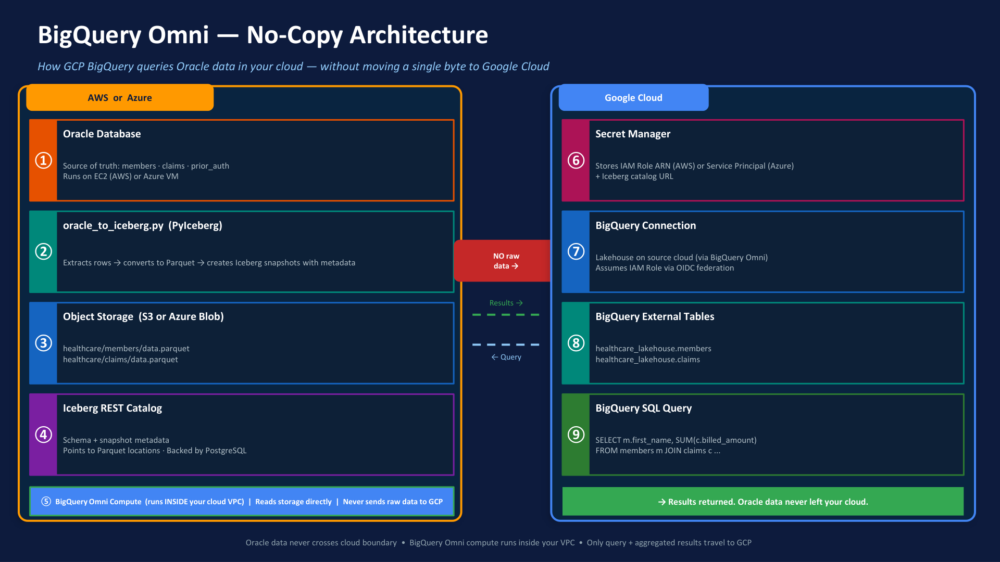
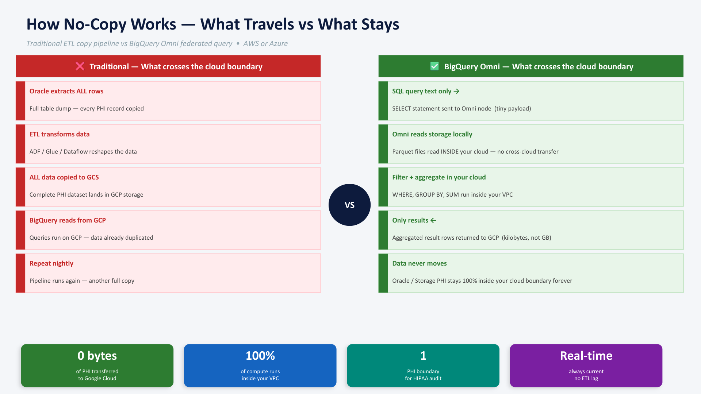
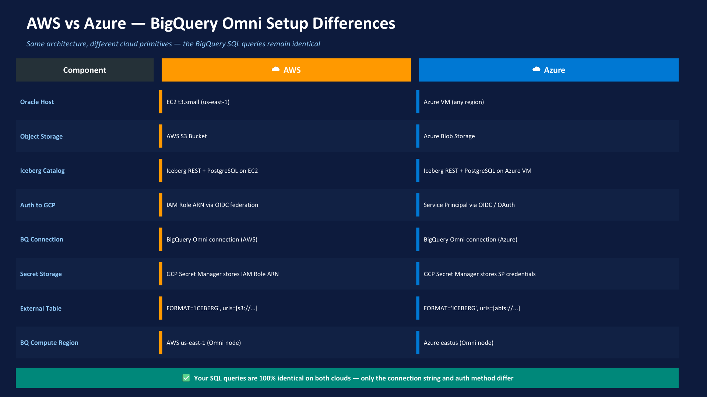

# Cross-Cloud Lakehouse POC

Extract healthcare data from Oracle XE, write it as Iceberg tables to cloud object storage, and query it from GCP BigQuery Omni — without moving the data between clouds.

---

## BigQuery Omni — No-Copy Architecture

> Full visual reference: [bigquery_omni_generic.pdf](bigquery_omni_generic.pdf)



How GCP BigQuery queries Oracle data in your cloud — without moving a single byte to Google Cloud.

| Step | Where | What happens |
|------|-------|-------------|
| ① | AWS / Azure | Oracle Database (EC2 or Azure VM) — source of truth: members · claims · prior_auth |
| ② | AWS / Azure | `oracle_to_iceberg.py` (PyIceberg) — extracts rows → Parquet → Iceberg snapshots |
| ③ | AWS / Azure | Object Storage (S3 or Azure Blob) — `healthcare/members/data.parquet` etc. |
| ④ | AWS / Azure | Iceberg REST Catalog — schema + snapshot metadata, backed by PostgreSQL |
| ⑤ | AWS / Azure | BigQuery Omni Compute runs **inside your VPC** — reads storage directly, never sends raw data to GCP |
| ⑥ | Google Cloud | Secret Manager — stores IAM Role ARN (AWS) or Service Principal (Azure) + catalog URL |
| ⑦ | Google Cloud | BigQuery Connection — assumes IAM Role via OIDC federation |
| ⑧ | Google Cloud | BigQuery External Tables — `healthcare_lakehouse.members`, `healthcare_lakehouse.claims` |
| ⑨ | Google Cloud | BigQuery SQL Query — results returned; Oracle data never left your cloud |

> Oracle data never crosses cloud boundary · BigQuery Omni compute runs inside your VPC · Only query + aggregated results travel to GCP

---

## How No-Copy Works — What Travels vs What Stays



| | Traditional ETL | BigQuery Omni |
|---|---|---|
| Step 1 | Oracle extracts ALL rows — full table dump, every PHI record copied | SQL query text only → SELECT sent to Omni node (tiny payload) |
| Step 2 | ETL transforms data — ADF / Glue / Dataflow reshapes it | Omni reads Parquet locally — inside your cloud, no cross-cloud transfer |
| Step 3 | ALL data copied to GCS — complete PHI dataset lands in GCP storage | Filter + aggregate in your cloud — WHERE, GROUP BY, SUM run inside VPC |
| Step 4 | BigQuery reads from GCP — data already duplicated | Only results returned — aggregated rows back to GCP (kilobytes, not GB) |
| Step 5 | Repeat nightly — pipeline runs again, another full copy | Data never moves — Oracle / Storage PHI stays 100% inside your cloud |

**Key guarantees:**

| Metric | Value |
|--------|-------|
| PHI transferred to Google Cloud | **0 bytes** |
| Compute running inside your VPC | **100%** |
| PHI boundary for HIPAA audit | **1** |
| Data freshness | **Real-time** — no ETL lag |

---

## AWS vs Azure — BigQuery Omni Setup Differences



Same architecture, different cloud primitives — the BigQuery SQL queries remain identical.

| Component | AWS | Azure |
|-----------|-----|-------|
| Oracle Host | EC2 t3.small (us-east-1) | Azure VM (any region) |
| Object Storage | AWS S3 Bucket | Azure Blob Storage |
| Iceberg Catalog | Iceberg REST + PostgreSQL on EC2 | Iceberg REST + PostgreSQL on Azure VM |
| Auth to GCP | IAM Role ARN via OIDC federation | Service Principal via OIDC / OAuth |
| BQ Connection | BigQuery Omni connection (AWS) | BigQuery Omni connection (Azure) |
| Secret Storage | GCP Secret Manager stores IAM Role ARN | GCP Secret Manager stores SP credentials |
| External Table URI | `FORMAT='ICEBERG', uris=[s3://...]` | `FORMAT='ICEBERG', uris=[abfs://...]` |
| BQ Compute Region | AWS us-east-1 (Omni node) | Azure eastus (Omni node) |

> Your SQL queries are 100% identical on both clouds — only the connection string and auth method differ.

---

## Folder Structure

```
cross-cloud-lakehouse/
├── README.md                        ← you are here
├── init/                            ← shared Oracle XE init scripts (Docker)
│   └── 01_healthcare_setup.sql
├── oracle_setup_healthcare.sql      ← shared manual Oracle setup
├── aws/                             ← AWS S3 + Iceberg POC
│   ├── README.md
│   ├── docker-compose.yml           ← Iceberg REST catalog + MinIO + Postgres
│   ├── oracle_to_iceberg_aws.py
│   ├── oracle_to_iceberg_proper.py
│   └── bigquery/
│       ├── create_iceberg_tables.sql  ← BigQuery via REST catalog + Cloudflare tunnel
│       └── healthcare_queries.sql
└── azure/                           ← Azure ADLS Gen2 + Iceberg + BigQuery Omni POC
    ├── README.md
    ├── docker-compose.yml           ← Oracle XE + Iceberg REST + Postgres
    ├── oracle_to_iceberg_azure.py
    └── bigquery/
        ├── create_iceberg_tables.sql  ← BigQuery Omni via azure-eastus2 connection
        └── healthcare_queries.sql
```

---

## Dataset

Three healthcare tables extracted from Oracle XE:

| Table | Description |
|-------|-------------|
| `members` | Health plan members — demographics and enrollment |
| `claims` | Medical claims — diagnosis, procedure, amount, status |
| `prior_auth` | Prior authorization requests — procedure approvals/denials |

---

## Quick Start

See the README in each subfolder:
- AWS → [aws/README.md](aws/README.md)
- Azure + BigQuery Omni → [azure/README.md](azure/README.md)
